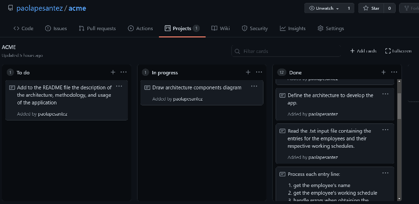

# ACME
Console application that calculates the salary of employees working at ACME. 

## Problem Description
The company ACME offers their employees the flexibility to work the hours they want. They will pay for the hours worked based on the day of the week and time of day, according to the following table:

| Weekday (Monday-Friday) | Weekend (Saturday and Sunday) |
| ------ | ------ |
| 00:01 - 09:00  --> $25| 00:01 - 09:00  --> $30|
| 09:01 - 18:00  --> $15| 09:01 - 18:00  --> $20|
| 18:01 - 00:00  --> $20| 18:01 - 00:00  --> $25|

The goal of this exercise is to calculate the total that the company has to pay an employee, based on the hours they worked and the times during which they worked. The following abbreviations will be used for entering data:

| Monday | Tuesday|Wednesday|Thursday|Friday|Saturday|Sunday|
| ------ | ------ | ------ | ------ | ------ | ------ | ------ |
| MO | TU|WE|TH|FR|SA|SU|

Input: the name of an employee and the schedule they worked, indicating the time and hours. This should be a .txt file with at least five sets of data. You can include the data from our two examples below.

Output: indicate how much the employee has to be paid

For example:
| Case| Input|Output|
| ------ | ------ | ------ |
| 1 | RENE=MO10:00-12:00,TU10:00-12:00,TH01:00-03:00,SA14:00-18:00,SU20:00-21:00|The amount to pay RENE is: 215 USD|
| 2 | ASTRID=MO10:00-12:00,TH12:00-14:00,SU20:00-21:00|The amount to pay ASTRID is: 85 USD|

## Usage
- Clone project from Github
    ```console
    git clone https://github.com/paolapesantez/acme.git
    ```

- Change to application directory
    ```console
    cd acme
    ```

- Run application 
    - DON'T forget that you need to provide an input file name. To do so use `--input or -i <filename> (REQUIRED)`
        ```console
        python app.py --input <your data file>
        ```
    - Make sure that the input file has been created inside the directory where you are running the application. Although, creating the input files inside the data directory is recommended.
    - The directory data contains a testing input file you can use
        ```console
        python app.py --input data/input.txt
        ```
    - If you want to store the results in a file you can use --output or -o <filename>, although this is not required
        ```console
        python app.py --input data/input.txt --output data/output.txt
        ```
- Run tests      
    ```console
        python -m pytest
    ```
## Approach
I take a reasonable time to analyze what will be the flow of the application (user stories), it provides me with a clearer vision of how to structure the architecture. Once this structure has been set up I start developing a minimum viable product based on TDD, SOLID, DRY to make my code reusable and easy to understand for other developers.  

## Architecture
There are several architectures well known and used depending the particular problem such as: MVC, functional, module, hexagonal, clean, etc. However, I decided to adapt DDD (Domain Driven Design) for this particular problem. One of the advantages is that the structure allows the developers to understand the code easily.
The diagram was created using Lucidchart.
<p align="center">
  
</p>
    
    
## Methodology
Since this is a little project with just one developer I decided to use the Kanban agile methodology. Kanban helped me to stay focused on finishing existing work before starting a new one. I was able to maximize efficiency by setting priorities for the activities and improving and refactoring the code continuously.
To see the complete list of activities in the dashboard please follow the following link [Kanban Dashboard]
<p align="center">
  
</p>

    
 [Kanban Dashboard]: <https://github.com/paolapesantez/acme/projects/1>    
    
